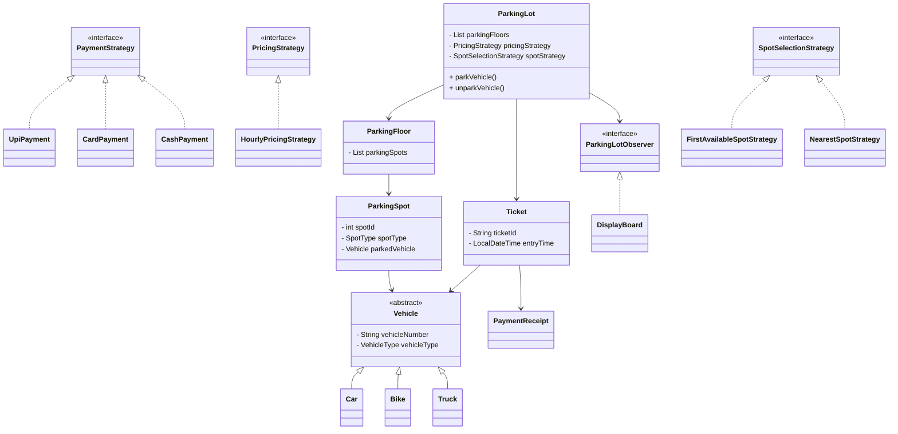
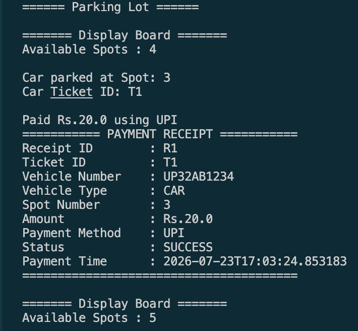

# 🚗 Parking Lot System


A Java-based Parking Lot System built using **Object-Oriented Programming (OOP)**, **SOLID Principles**, and multiple **Design Patterns**.

This project simulates a real-world parking lot capable of parking different vehicle types, generating parking tickets, calculating parking fees, processing payments, and updating the display board automatically.

---

# Features

- Park and Unpark Vehicles
- Support for Multiple Vehicle Types
  - 🚗 Car
  - 🏍 Bike
  - 🚚 Truck
- Automatic Ticket Generation
- Parking Fee Calculation
- Multiple Parking Spot Selection Strategies
- Multiple Payment Methods
- Payment Receipt Generation
- Live Display Board Updates
- Modular and Extensible Architecture

---

# Tech Stack

- Java 21
- Maven
- Object-Oriented Programming
- SOLID Principles
- Git
- GitHub

---

# Design Patterns Used

| Pattern | Usage |
|----------|-------|
| Factory Pattern | Vehicle Creation |
| Singleton Pattern | Parking Lot Instance |
| Strategy Pattern | Spot Selection & Fee Calculation |
| Observer Pattern | Display Board Updates |
| Command Pattern | Park & Unpark Operations |

---

# Project Structure

```text
src
└── main
    └── java
        └── com
            └── indu
                └── parkinglot
                    ├── command
                    ├── factory
                    ├── model
                    ├── observer
                    ├── payment
                    ├── service
                    ├── strategy
                    └── Main.java
```

---

# UML Class Diagram



---

# System Architecture

```text
                     +----------------------+
                     |       Main.java      |
                     +----------+-----------+
                                |
                                v
                    +-----------------------+
                    |      ParkingLot       |
                    +-----------------------+
                       |      |        |
           ------------       |        ------------
          |                   |                   |
          v                   v                   v
 Parking Floors       Pricing Strategy     Spot Strategy
          |                   |                   |
          v                   v                   v
 Parking Spots      Hourly Pricing      First Available
          |                              Nearest Spot
          |
          v
       Vehicle
          |
          v
        Ticket
          |
          v
      Payment Strategy
          |
     +----+-----+------+
     |          |      |
    UPI       Card   Cash
          |
          v
   Payment Receipt
```

---

# Parking Workflow

```text
Vehicle Arrives
      │
      ▼
Vehicle Factory
      │
      ▼
Spot Selection Strategy
      │
      ▼
Parking Spot Assigned
      │
      ▼
Ticket Generated
      │
      ▼
Vehicle Parked
      │
      ▼
Vehicle Exit
      │
      ▼
Fee Calculation Strategy
      │
      ▼
Payment Strategy
      │
      ▼
Payment Receipt Generated
```

---

# Payment Module

Supported payment methods:

- UPI
- Card
- Cash

Payment Status:

- SUCCESS
- FAILED
- PENDING

Each successful payment generates a detailed receipt containing:

- Receipt ID
- Ticket ID
- Vehicle Details
- Spot Number
- Amount
- Payment Method
- Payment Status
- Payment Time

---

# SOLID Principles Applied

- Single Responsibility Principle (SRP)
- Open/Closed Principle (OCP)
- Liskov Substitution Principle (LSP)
- Interface Segregation Principle (ISP)
- Dependency Inversion Principle (DIP)

---

# Key Learnings

During this project, I gained practical experience in:

- Designing scalable object-oriented systems
- Applying SOLID principles in real projects
- Implementing multiple GoF Design Patterns
- Decoupling components using interfaces
- Managing project structure using Maven
- Writing clean and maintainable Java code
- Maintaining meaningful Git commit history

---

# Sample Output

```text
====== Parking Lot ======

======= Display Board =======
Available Spots : 4

Car parked at Spot: 3
Car Ticket ID: T1

Paid Rs.20.0 using UPI

=========== PAYMENT RECEIPT ===========
Receipt ID        : R1
Ticket ID         : T1
Vehicle Number    : UP32AB1234
Vehicle Type      : CAR
Spot Number       : 3
Amount            : Rs.20.0
Payment Method    : UPI
Status            : SUCCESS
Payment Time      : 2026-07-23T16:52:48.879468
=======================================

======= Display Board =======
Available Spots : 5
```

---

## Console Output



---

# How to Run

Clone the repository

```bash
git clone https://github.com/imindusahu/parking-lot-system.git
```

Navigate to the project directory

```bash
cd parking-lot-system
```

Compile the project

```bash
mvn clean compile
```

Run the application

```bash
mvn exec:java -Dexec.mainClass="com.indu.parkinglot.Main"
```
---

# Future Improvements

- EV Charging Station Support
- Online Parking Slot Reservation
- Dynamic Pricing based on Peak Hours
- Admin Dashboard
- REST API using Spring Boot
- MySQL/PostgreSQL Integration
- JWT Authentication
- Email/SMS Notifications
- Docker Deployment
- Unit & Integration Testing

---

# Author

**Indu Sahu**

B.Tech Computer Science Engineering

Interested in Java Backend Development, Low Level Design, and Software Architecture.

GitHub:
https://github.com/imindusahu

---

## License

This project was built as part of my Java Low Level Design learning journey to practice Object-Oriented Design, SOLID Principles, and Design Patterns.